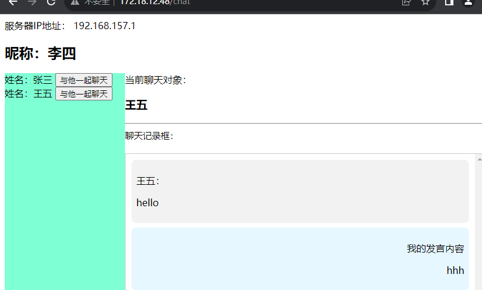
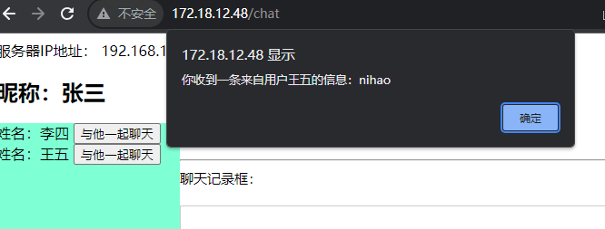

## 一个使用springboot Websocket实现的简单的局域网在线聊天室
### 使用方法
使用java -jar 命令运行release中发布的jar 包  
服务会在80 端口运行
在浏览器端口输入 服务启动机器所在的IP地址+/chat  即可进入聊天室 (你可以在CMD或powershell使用 ipconfig指令获取本机局域网ip地址) 
如：  
   
进入页面会提示你输入名称  
你和他人可以同时登录到该页面即可进行愉快的聊天了：  
  
  